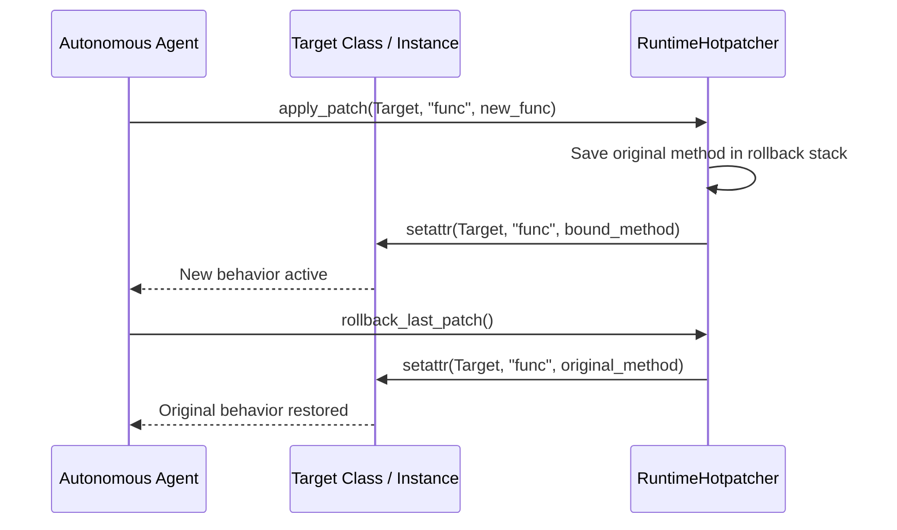

# GenPark Agent Runtime Hotpatch Sandbox Injector Skill

Dynamic in-memory method replacement and self-adaptation engine with deterministic rollback checkpoints.

Explore more at [GenPark](https://genpark.ai) and the [GenPark MCP Catalog](https://genpark.ai/mcp).

## Features
- Dynamic runtime method binding with standard library `types.MethodType`.
- Stack-based rollback mechanism for risk-free self-adaptation.
- Zero external dependencies.
